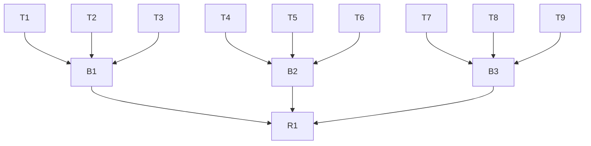
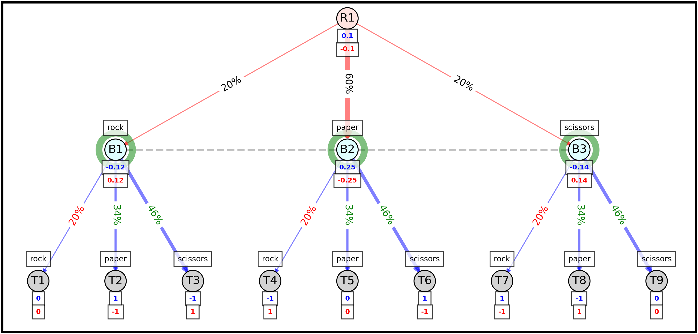

<p align="center">
  <a href="https://github.com/destin-v">
    
  </a>
</p>

# 📒 Description

<p align="center">
    
</p>

<p align="center">
  <a href="https://devguide.python.org/versions/">              </a>
  <a href="https://docs.github.com/en/actions/quickstart">      </a>
  <a href="https://black.readthedocs.io/en/stable/index.html">  </a>
</p>

<p align="center">
  <a href="https://github.com/destin-v/dentro/actions/workflows/pre-commit.yml">  </a>
  <a href="https://github.com/destin-v/dentro/actions/workflows/pdoc.yml">        </a>
  <a href="https://github.com/destin-v/dentro/actions/workflows/pytest.yml">      </a>
</p>

Dentro is an implementation of Counter Factual Regret Minimization (CFRM).  It provides the basic building blocks needed to assemble your own graphs and solve the problem using the provided algorithm.  This repo shows CFRM applied to the game of rock-paper-scissors.

Nodes represent game states and edges represent possible decisions paths.  The agents greedily selects the decision paths that have the highest expected value.  However, the expected values changed based on the decision probabilities of itself as well as its opponent.  The probabilities and expected value will change over time as the agents learns how to optimize their play.


# 📦 Installation

```terminal
conda create -n dentro python=3.10
conda activate dentro
pip install poetry
poetry install
```

# 🚀 Features
## Partial Observability
Partial observability is accounted for in CFRM by designating **aliased** nodes.  The simplest adversarial game that demonstrates partial observability is Rock-Paper-Scissors.  In Rock-Paper-Scissors the agent must optimize his decision process against an opponent's decision space that is partially observable (i.e. the agent does not know which state it is in).

To see an example of partial observability in action see [**here**](https://drive.google.com/file/d/1Z9IIOUuyM3wpZSTl5hxbEmediSaOe3-z/view?usp=share_link)

<p align="center">
    
</p>

<p align="center">
    <b>Fig 1: Rock Paper Scissor game represented as a game tree with terminal rewards.  The dashed lines indicated aliased states (meaning these states are indistinguishable from another).</b>
</p>

## Ray Integration
Dentro is built on Ray meaning you can easily scale processing using parallel resources on AWS, Azure, Google Cloud, Alibaba Cloud, etc.  No code rewrite are needed when scaling up your problem and no changes are needed when transferring to a new cloud service.

## Plots
Dentro comes with prebuilt plotting functions that will generate graphs for each training iteration.  This is helpful when you want to track how the agents adjust their probabilities after an update.  The plotting packages are built using Matplotlib making modifications easy to implement.

# 💡 Examples
Rock-Paper-Scissors shows how to model an adversarial game with partially observable states and stochastic decision making.

The game design of Rock-Paper-Scissors can be found in `src/games.py`.  An example of how to run CFRM with Rock-Paper-Scissors can be found in `tests/game_test.py::test_rock_paper_scissors`

```python
def test_rock_paper_scissors():
    G = rock_paper_scissors()   # construction of game tree (nodes, decision branches, and terminal rewards)

    run_cfr(
        G,
        players=["cat", "dog"],              # players in the game
        n_iterations=10,                      # number of iterations to run
        n_rollouts=1000,                      # number of rollouts to perform per update
        save_path="save/rock-paper-scissors", # save path of files
        graph_id="rps.networkx",              # filename to save trained weights to
        fig_x_size=14,                        # size of figures to save
        fig_y_size=9,                         # size of figures to save
    )
```

Running this function will generate plots in the `save_path` where you can view how the algorithm converges at each iteration.  A binary file with the learned graph will be saved to the same directory.  The graph can be reloaded and training can continue from the previous session.

# 🎼 Tests
To run all tests execute the following in a terminal.

```terminal
pytest
```

# ✨ References
* Neller, T. W., & Lanctot, M. (2013). An Introduction to Counterfactual Regret Minimization. Educational Advances in Artificial Intelligence. http://modelai.gettysburg.edu/2013/cfr/cfr.pdf

# ♖ Distribution

DISTRIBUTION STATEMENT A. Approved for public release. Distribution is unlimited.

This material is based upon work supported by the Department of the Air Force under Air Force Contract No. FA8702-15-D-0001. Any opinions, findings, conclusions or recommendations expressed in this material are those of the author(s) and do not necessarily reflect the views of the Department of the Air Force.

© 2024 Massachusetts Institute of Technology.

The software/firmware is provided to you on an As-Is basis

Delivered to the U.S. Government with Unlimited Rights, as defined in DFARS Part 252.227-7013 or 7014 (Feb 2014). Notwithstanding any copyright notice, U.S. Government rights in this work are defined by DFARS 252.227-7013 or DFARS 252.227-7014 as detailed above. Use of this work other than as specifically authorized by the U.S. Government may violate any copyrights that exist in this work.
